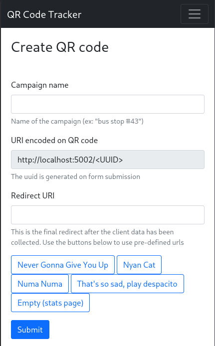
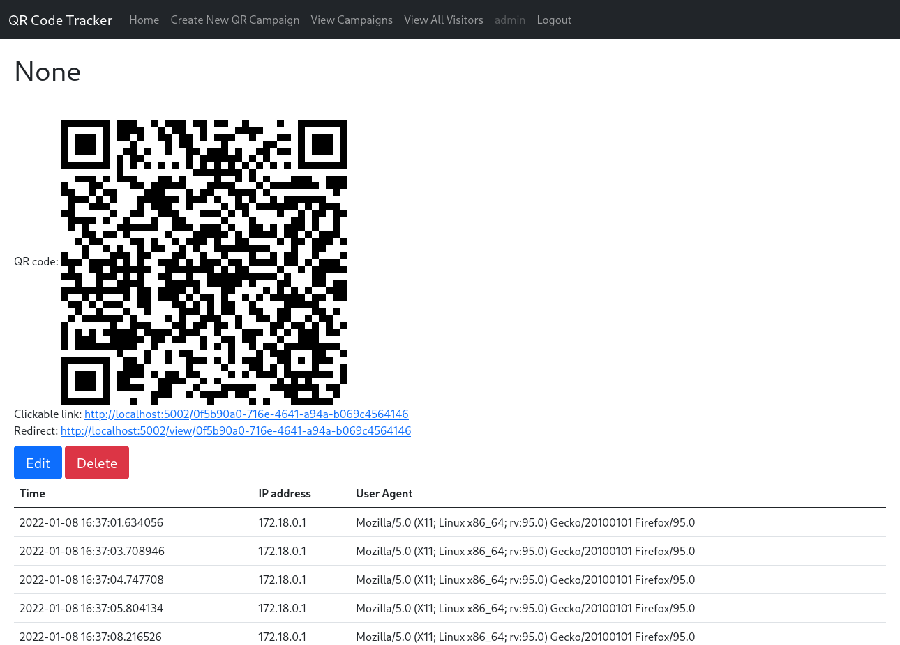
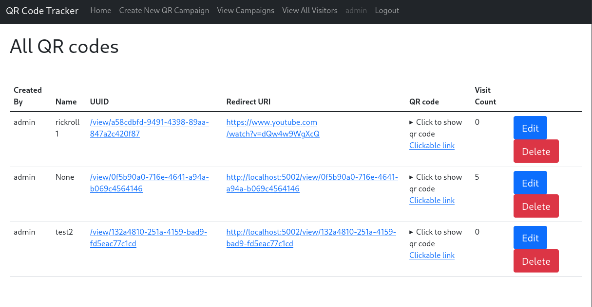
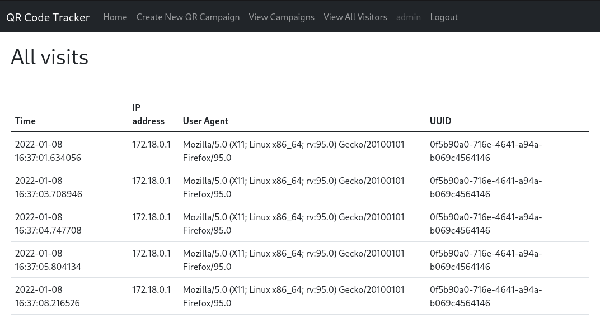

# QR Tracker

## What is this?

Due to the increased useage of QR codes due to the ongoing pandemic, I was curious about how many people were scanning random QR codes.
Further, I saw this as an opportunity to create prank QR codes.

# Who would use this?

This can be used to add some lighthearted fun, or to assess the security posture of your org (i.e. will employees scan random QR codes and then open the links)

# How it works
The process flow is described below:


The QR code contains only a link to the web app.
The web app collects IP address and user agent strings from anyone who visits the link encoded on the QR code, and stores them in a database.
Finally, the visitor is redirected either to a page explaining what this app does, or to the defined url.

# Admin interface

Log in after following the instructions in [Deployment](#Deployment)

## Creating a QR campaign

A campaign is just a way to label where a QR code has been distributed.
For example, while conducting an informal experiment, two locations have been identified, such as a bus stop and a bulletin board.
Two separate campaigns would allow identification of which location the user was when scanning the code.




Once created, the data collected can be viewed.


All in progress campaigns are shown


Finally, all visitors can be listed. The ability to export these is a planned feature, not yet implemented.


All visitors


Anyone who has followed the link on the QR code is shown a message that explains what data is collected.


# Deployment

To deploy, simply clone the repository and create the following files:

* .env
  ```
  FLASK_SECRET_KEY=<some really secure string>
  URL_BASE=localhost:5002
  ```
* app/secrets.py
  ```
  users = {'admin': {'password': '<some really secure password>'}}
  ```
Lastly, run
`docker-compose up --build`

It is suggested that a reverse proxy be used to route a subdomain to the app and handle https certs.

# Future work

There are a few enhancements I'd like to make.

1. fully implement the javascript fingerprinting. Right now, it is non-functional and really just a proof of concept (it prints the screen height/width in the terminal)

# License

I chose the MIT license for this project. My preference is that this not be used for evil. If you've found this useful and would like to contribute, you can buy me a coffee https://ko-fi.com/haicen

# FAQ's

* Is this malicious?
  * No, but it could be used for phishing if instead of redirecting to rickroll or the stats page, it directed the victim to log in to "facebook"
* Does this collect Personally Identifying Information (PII)?
  * No, the only information collected is the user's IP address and user agent. This information is sent to any website you view.
* How does it work
